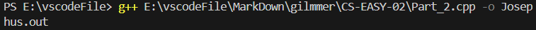

# 数据结构的应用
## 解密结果
Part1得到的链表从头节点开始打印到尾节点，结果为：1111212211212132111111122212211222

Part2得到的密文串为：3112212112122112211221122112111112

Part3解密结果为：glimmerinheartnofear4dark
（各个Part的过程分别在各自代码文件中）

>Part2 中要求生成josephus.out 文件，我查询了好像a.out文件是linux中的可执行文件，但用VMware虚拟机里的linux生成的文件没办法导出来（试过共享文档了，但在linux 里找不到共享的文件夹），于是就用这中方法生成了，不知道对不对

>Part3 中我的栈是按自己理解的建的链栈，但好像一般会出现栈满的情况，但链栈不清楚一般怎么判断栈满的情况（是要遍历一遍栈看节点个数然后再判断吗，那理论上每次压入都要判断一次，时间复杂度不会很高吗）（还是说栈内节点个数是一个栈的基本参数，然后压入弹出的时候都会改变，每次用这个参数来判断栈满呢）

>ps：对Part2,Part3部分代码进行了修改。Part2中使最终的程序可以生成Josephus.out文件(Part_2.exe执行后会生成)。Part3中的密文串可以从Part2生成的Josephus.out文件中读取（原来是直接初始化了一个数组储存了）
